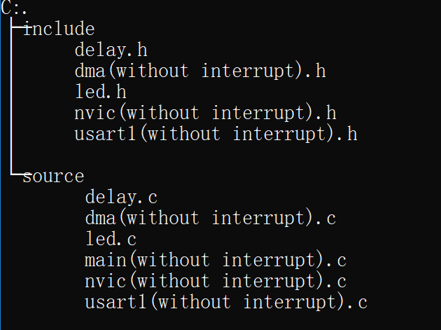

# DMA

这里我采用了两种方法来利用**串口通信+DMA**来实现LED的点亮。

其实根据文件夹的名称可以很容易看出，一种是**带中断**的，而另一种是**不带中断**的。

1. 不带中断的，是根据STM32F1开发指南上来写的，主要是用**一个死循环+不停地检测标志位**来判断是否发生DMA事件。
2. 带中断的，逻辑上更为简单，就是**用中断来检测DMA事件的发生。**

--------------------------------------

文档树如下所示：

1. 不带中断的：

